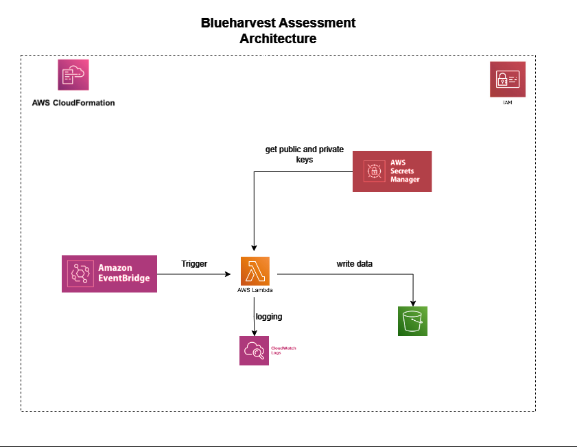

# Marvel Comics Data Collection

## Overview
This project aims to collect data from the Marvel API to gather information about characters and the quantity of comics they appear in. It provides a solution to the basic data engineering problem outlined in the project description.

## Solution Explanation
The solution involves fetching all character data and comic data from the Marvel API using asynchronous requests. It retrieves information about characters and the quantity of comics they appear in. The data is then processed and stored in DataFrames using pandas. Finally, the DataFrames are uploaded to an S3 bucket for storage.

## Clone Repo

-   `$ git clone https://github.com/Optimustprime/blueharvest.git`

## Deployment
To deploy the infrastructure using AWS CloudFormation, run the following command:
```bash
aws cloudformation create-stack \
    --stack-name ComicDataStack \
    --template-body file://cft.yaml \
    --capabilities CAPABILITY_NAMED_IAM \
    --parameters ParameterKey=PublicKey,ParameterValue=yourpublickey \
                 ParameterKey=PrivateKey,ParameterValue=yourprivatekey \
    --region us-east-1
```
## Architecture Diagram



### Steps to run solution

- Configure CLI uisng 'aws configure sso'
- Deploy stack using cloud formation
- Trigger Lambda using the EvenBridge rule


### Testing
```bash
  pytest
```