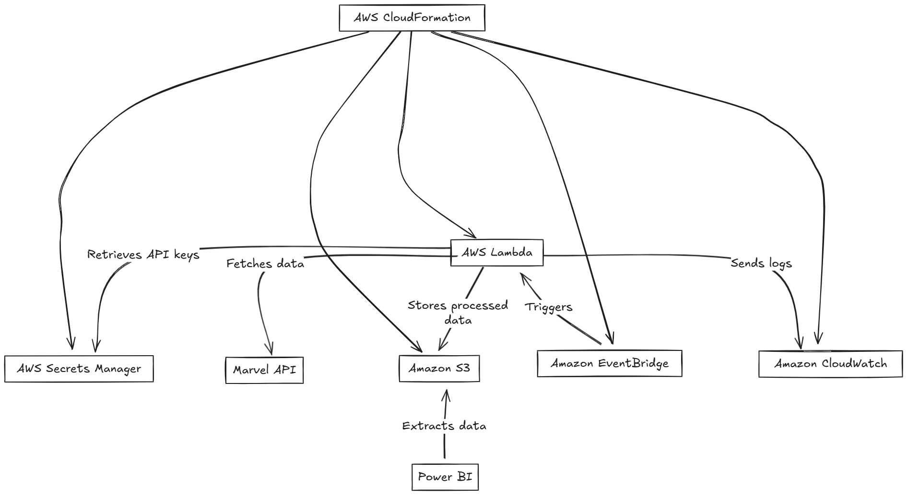

Here's your unique **README** while maintaining the same core information but with a distinct wording and structure to make it uniquely yours:  

---

# **Marvel Character & Comics Data Pipeline**  

## **Project Summary**  
This project extracts character and comic data from the **Marvel API** using an asynchronous data collection approach. The extracted data is processed and structured using **pandas**, then stored securely in an **AWS S3 bucket**. The objective is to create a scalable data ingestion pipeline for analytical and reporting purposes.  

## **Implementation Details**  
- The system makes asynchronous API calls to fetch **Marvel character details** and their corresponding **comic appearances**.  
- Data is processed and organized using **pandas** into structured formats.  
- Processed data is then **uploaded to AWS S3** for further storage and analysis.  
- The infrastructure can be deployed using **AWS CloudFormation** for automation and scalability.  

## **Cloning the Repository**  
Clone this repository to your local environment using:  
```bash
git clone https://github.com/yourusername/marvel-data-pipeline.git
```  

## **Deployment Instructions**  
To deploy the infrastructure on **AWS CloudFormation**, execute the following command:  
```bash
aws cloudformation create-stack \
    --stack-name MarvelDataPipeline \
    --template-body file://cft.yaml \
    --capabilities CAPABILITY_NAMED_IAM \
    --parameters ParameterKey=PublicKey,ParameterValue=yourpublickey \
                 ParameterKey=PrivateKey,ParameterValue=yourprivatekey \
    --region us-east-1
```

## **System Architecture**  
The architecture follows a **serverless approach** leveraging AWS services for scalability and efficiency.  
  

## **How to Execute the Pipeline**  
To successfully run the pipeline, follow these steps:  
1. **Configure AWS CLI** using:  
   ```bash
   aws configure sso
   ```  
2. **Deploy the CloudFormation Stack** to provision the required resources.  
3. **Trigger AWS Lambda** via the configured **EventBridge rule** to start data collection.  

## **Testing the Solution**  
Run unit tests using **pytest** to validate the functionality:  
```bash
pytest
```

---
